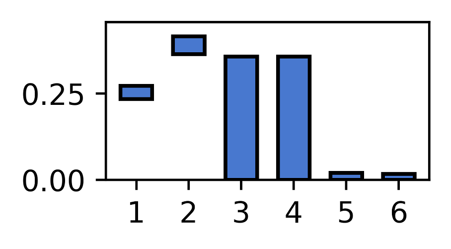

# Feature Relevance Intervals - FRI




[](https://doi.org/10.5281/zenodo.1188749)
[](https://colab.research.google.com/github/lpfann/fri/blob/master/doc/source/notebooks/Guide.ipynb)


__FRI__ is a Python 3 package for analytical feature selection
purposes. It allows superior feature selection in the sense that all
important features are conserved. At the moment we support multiple
linear models for solving Classification, Regression and Ordinal
Regression Problems. We also support LUPI paradigm where at learning
time, privileged information is available.


## Documentation
Check out our online documentation [here](https://lpfann.github.io/fri/).
There you can find a quick start guide and more background information.

You can also run the guide directly without setup online [here](https://colab.research.google.com/github/lpfann/fri/blob/master/doc/source/notebooks/Guide.ipynb).


## Installation
`FRI` requires __Python 3.6+__. 

For a __stable__ version from `PyPI` use
```shell
$ pip install fri
```

## Usage
Please refer to the [documentation](https://lpfann.github.io/fri/) for advice.
For a quick start we provide a simple guide which leads through the main functions.

## References  

[1] Göpfert C, Pfannschmidt L, Hammer B. Feature Relevance Bounds for Linear Classification. In: Proceedings of the ESANN. 25th European Symposium on Artificial Neural Networks, Computational Intelligence and Machine Learning;
<https://pub.uni-bielefeld.de/publication/2908201>

[2] Göpfert C, Pfannschmidt L, Göpfert JP, Hammer B. Interpretation of Linear Classifiers by Means of Feature Relevance Bounds. Neurocomputing.
<https://pub.uni-bielefeld.de/publication/2915273>

[3] Lukas Pfannschmidt, Jonathan Jakob, Michael Biehl, Peter Tino, Barbara Hammer: Feature Relevance Bounds for Ordinal Regression. Proceedings of the ESANN. 27th European Symposium on Artificial Neural Networks, Computational Intelligence and Machine Learning; Accepted.
<https://pub.uni-bielefeld.de/record/2933893>

[4] Pfannschmidt L, Göpfert C, Neumann U, Heider D, Hammer B: FRI - Feature Relevance Intervals for Interpretable and Interactive Data Exploration. Presented at the 16th IEEE International Conference on Computational Intelligence in Bioinformatics and Computational Biology, Certosa di Pontignano, Siena - Tuscany, Italy. <https://ieeexplore.ieee.org/document/8791489>
