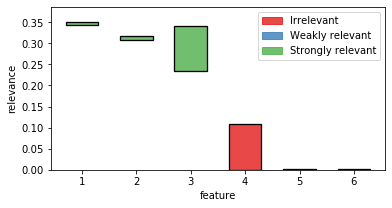
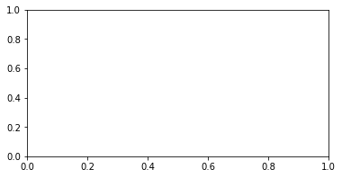

# Quick start guide


## Installation
### Stable
Fri can be installed via the Python Package Index (PyPI).

If you have `pip` installed just execute the command

    pip install fri
   
to get the newest stable version.

The dependencies should be installed and checked automatically.
If you have problems installing please open issue at our [tracker](https://github.com/lpfann/fri/issues/new).

### Development
To install a bleeding edge dev version of `FRI` you can clone the GitHub repository using

    git clone git@github.com:lpfann/fri.git

and then check out the `dev` branch: `git checkout dev`.

To check if everything works as intented you can use `pytest` to run the unit tests.
Just run the command

    pytest

in the main project folder


```python
# For the purpose of viewing this notebook online we install the library directly with pip
!pip install fri
```

    Requirement already satisfied: fri in /home/lpfannschmidt/Dropbox/Promotion/prj/om_estimator (6.0.0+160.g95126ec)
    Requirement already satisfied: numpy in /home/lpfannschmidt/anaconda3/lib/python3.7/site-packages (from fri) (1.16.4)
    Requirement already satisfied: scipy>=1.0 in /home/lpfannschmidt/anaconda3/lib/python3.7/site-packages (from fri) (1.3.0)
    Requirement already satisfied: scikit-learn>=0.21.1 in /home/lpfannschmidt/anaconda3/lib/python3.7/site-packages (from fri) (0.21.3)
    Requirement already satisfied: joblib>=0.13.2 in /home/lpfannschmidt/anaconda3/lib/python3.7/site-packages (from fri) (0.13.2)
    Requirement already satisfied: cvxpy>=1.0.21 in /home/lpfannschmidt/anaconda3/lib/python3.7/site-packages (from fri) (1.0.24)
    Requirement already satisfied: ecos>=2.0.5 in /home/lpfannschmidt/anaconda3/lib/python3.7/site-packages (from fri) (2.0.7.post1)
    Requirement already satisfied: matplotlib in /home/lpfannschmidt/anaconda3/lib/python3.7/site-packages (from fri) (3.1.1)
    Requirement already satisfied: multiprocess in /home/lpfannschmidt/anaconda3/lib/python3.7/site-packages (from cvxpy>=1.0.21->fri) (0.70.8)
    Requirement already satisfied: six in /home/lpfannschmidt/anaconda3/lib/python3.7/site-packages (from cvxpy>=1.0.21->fri) (1.12.0)
    Requirement already satisfied: scs>=1.1.3 in /home/lpfannschmidt/anaconda3/lib/python3.7/site-packages (from cvxpy>=1.0.21->fri) (2.1.1.post2)
    Requirement already satisfied: osqp>=0.4.1 in /home/lpfannschmidt/anaconda3/lib/python3.7/site-packages (from cvxpy>=1.0.21->fri) (0.5.0)
    Requirement already satisfied: python-dateutil>=2.1 in /home/lpfannschmidt/anaconda3/lib/python3.7/site-packages (from matplotlib->fri) (2.8.0)
    Requirement already satisfied: pyparsing!=2.0.4,!=2.1.2,!=2.1.6,>=2.0.1 in /home/lpfannschmidt/anaconda3/lib/python3.7/site-packages (from matplotlib->fri) (2.4.2)
    Requirement already satisfied: cycler>=0.10 in /home/lpfannschmidt/anaconda3/lib/python3.7/site-packages (from matplotlib->fri) (0.10.0)
    Requirement already satisfied: kiwisolver>=1.0.1 in /home/lpfannschmidt/anaconda3/lib/python3.7/site-packages (from matplotlib->fri) (1.1.0)
    Requirement already satisfied: dill>=0.3.0 in /home/lpfannschmidt/anaconda3/lib/python3.7/site-packages (from multiprocess->cvxpy>=1.0.21->fri) (0.3.0)
    Requirement already satisfied: future in /home/lpfannschmidt/anaconda3/lib/python3.7/site-packages (from osqp>=0.4.1->cvxpy>=1.0.21->fri) (0.17.1)
    Requirement already satisfied: setuptools in /home/lpfannschmidt/anaconda3/lib/python3.7/site-packages (from kiwisolver>=1.0.1->matplotlib->fri) (41.0.1)


## Using FRI
Now we showcase the workflow of using FRI on a simple classification problem.

### Data
To have something to work with, we need some data first.
`fri` includes a generation method for binary classification and regression data.

In our case we need some classification data.


```python
from fri import genClassificationData
```

We want to create a small set with a few features.

Because we want to showcase the all-relevant feature selection, we generate multiple strongly and weakly relevant features.


```python
n = 100
features = 6
strongly_relevant = 2
weakly_relevant = 2
```


```python
X,y = genClassificationData(n_samples=n,
                            n_features=features,
                            n_strel=strongly_relevant,
                            n_redundant=weakly_relevant,
                            random_state=123)
```

The method also prints out the parameters again.


```python
X.shape
```


    (100, 6)


We created a binary classification set with 6 features of which 2 are strongly relevant and 2 weakly relevant.

#### Preprocess
Because our method expects mean centered data we need to standardize it first.
This centers the values around 0 and deviation to the standard deviation


```python
from sklearn.preprocessing import StandardScaler
X_scaled = StandardScaler().fit_transform(X)
```

### Model
Now we need to creata a Model. 

We use the `FRI` module.


```python
import fri
```

`fri` provides a convenience class `fri.FRI` to create a model.

`fri.FRI` needs the type of problem as a first argument of type `ProblemName`.

Depending on the Problem you want to analyze pick from one of the available models in `ProblemName`.


```python
list(fri.ProblemName)
```


    [<ProblemName.CLASSIFICATION: <class 'fri.model.classification.Classification'>>,
     <ProblemName.REGRESSION: <class 'fri.model.regression.Regression'>>,
     <ProblemName.ORDINALREGRESSION: <class 'fri.model.ordinal_regression.OrdinalRegression'>>,
     <ProblemName.LUPI_CLASSIFICATION: <class 'fri.model.lupi_classification.LUPI_Classification'>>,
     <ProblemName.LUPI_REGRESSION: <class 'fri.model.lupi_regression.LUPI_Regression'>>,
     <ProblemName.LUPI_ORDREGRESSION: <class 'fri.model.lupi_ordinal_regression_exp.LUPI_OrdinalRegression'>>]


Because we have Classification data we use the `ProblemName.CLASSIFICATION` to instantiate our model.


```python
fri_model = fri.FRI(fri.ProblemName.CLASSIFICATION,slack_loss=0.001,slack_regularization=0.001)
```


```python
fri_model
```


    FRI(n_jobs=1, n_param_search=50, n_probe_features=80, normalize=True,
        problemName=None,
        random_state=<mtrand.RandomState object at 0x7f2f94384288>, slack_loss=None,
        slack_regularization=None, verbose=0)


We used no parameters for creation so the defaults are active.

#### Fitting to data
Now we can just fit the model to the data using `scikit-learn` like commands.


```python
fri_model.fit(X_scaled,y)
```


    FRI(n_jobs=1, n_param_search=50, n_probe_features=80, normalize=True,
        problemName=None,
        random_state=<mtrand.RandomState object at 0x7f2f94384288>, slack_loss=None,
        slack_regularization=None, verbose=0)


The resulting feature relevance bounds are saved in the `interval_` variable.


```python
fri_model.interval_
```


    array([[0.34388504, 0.35158714],
           [0.3087857 , 0.31784745],
           [0.23366248, 0.34163576],
           [0.        , 0.10814646],
           [0.        , 0.00287764],
           [0.        , 0.0025781 ]])


If you want to print out the relevance class use the `print_interval_with_class()` function.


```python
print(fri_model.print_interval_with_class())
```

    ############## Relevance bounds ##############
    feature: [LB -- UB], relevance class
          0: [0.3 -- 0.4], Strong relevant
          1: [0.3 -- 0.3], Strong relevant
          2: [0.2 -- 0.3], Strong relevant
          3: [0.0 -- 0.1], Irrelevant
          4: [0.0 -- 0.0], Irrelevant
          5: [0.0 -- 0.0], Irrelevant
    


The bounds are grouped in 2d sublists for each feature.


To acess the relevance bounds for feature 2 we would use


```python
fri_model.interval_[2]
```


    array([0.23366248, 0.34163576])


The relevance classes are saved in the corresponding variable `relevance_classes_`:


```python
fri_model.relevance_classes_
```


    array([2, 2, 2, 0, 0, 0])


`2` denotes strongly relevant features, `1` weakly relevant and `0` irrelevant.

#### Plot results

The bounds in numerical form are useful for postprocesing.
If we want a human to look at it, we recommend the plot function `plot_relevance_bars`.

We can also color the bars according to `relevance_classes_`


```python
# Import plot function
from fri.plot import plot_relevance_bars
import matplotlib.pyplot as plt
%matplotlib inline
# Create new figure, where we can put an axis on
fig, ax = plt.subplots(1, 1,figsize=(6,3))
# plot the bars on the axis, colored according to fri
out = plot_relevance_bars(ax,fri_model.interval_,classes=fri_model.relevance_classes_)
```





### Print internal Parameters

If we want to take at internal parameters, we can use the `verbose` flag in the model creation.


```python
fri_model = fri.FRI(fri.ProblemName.CLASSIFICATION, verbose=True)
```


```python
fri_model.fit(X_scaled,y)
```

    Fitting 3 folds for each of 50 candidates, totalling 150 fits


    [Parallel(n_jobs=1)]: Using backend SequentialBackend with 1 concurrent workers.
    [Parallel(n_jobs=1)]: Done 150 out of 150 | elapsed:    0.9s finished
    [Parallel(n_jobs=1)]: Using backend SequentialBackend with 1 concurrent workers.
    [Parallel(n_jobs=1)]: Done  18 out of  18 | elapsed:    0.2s finished
    [Parallel(n_jobs=1)]: Using backend SequentialBackend with 1 concurrent workers.


    ******************** Best found baseline model ********************
    Classification_SVM(C=2.252620785394559)
    score:  0.98
    'loss: 3.912340912240545'
    'w_l1: 10.701925716627462'
    'w: shape (6,)'
    'b: shape ()'
    'slack: shape (100,)'
    ******************************


    [Parallel(n_jobs=1)]: Done 160 out of 160 | elapsed:    1.5s finished
    [Parallel(n_jobs=1)]: Using backend SequentialBackend with 1 concurrent workers.


    FS threshold: -0.020384605044528673-0.024502494977920716, Mean:0.002058944966696022, Std:0.005444840132729435, n_probes 43
    FS threshold: -0.03633035235181863-0.14343569308400425, Mean:0.05355267036609281, Std:0.021690778769127776, n_probes 41


    [Parallel(n_jobs=1)]: Done  80 out of  80 | elapsed:    0.8s finished


    FRI(n_jobs=1, n_param_search=50, n_probe_features=80, normalize=True,
        problemName=None,
        random_state=<mtrand.RandomState object at 0x7f2f94384288>, slack_loss=None,
        slack_regularization=None, verbose=True)


This prints out the parameters of the baseline model

One can also see the best selected hyperparameter according to gridsearch and the training score of the model in `score`.


### Setting constraints manually
Our model also allows to compute relevance bounds when the user sets a given range for the features.

We use a dictionary to encode our constraints.


```python
preset = {}
```

#### Example
As an example, let us constrain the third from our example to the minimum relevance bound.


```python
preset[2] = fri_model.interval_[2, 0]
```

We use the function `constrained_intervals`.

Note: we need to fit the model before we can use this function.
We already did that, so we are fine.


```python
const_ints = fri_model.constrained_intervals(preset=preset)
```


    ---------------------------------------------------------------------------

    IndexError                                Traceback (most recent call last)

    <ipython-input-25-b9f69bfa650a> in <module>
    ----> 1 const_ints = fri_model.constrained_intervals(preset=preset)
    

    ~/Dropbox/Promotion/prj/om_estimator/fri/main.py in constrained_intervals(self, preset)
        215 
        216         return self._relevance_bounds_computer.compute_multi_preset_relevance_bounds(preset=preset,
    --> 217                                                                                      lupi_features=self.lupi_features_)
        218 
        219     def print_interval_with_class(self):


    ~/Dropbox/Promotion/prj/om_estimator/fri/compute.py in compute_multi_preset_relevance_bounds(self, preset, lupi_features)
        256 
        257         # Add sign to presets
    --> 258         preset = self._add_sign_to_preset(preset)
        259 
        260         # Calculate all bounds with feature i set to min_i


    ~/Dropbox/Promotion/prj/om_estimator/fri/compute.py in _add_sign_to_preset(self, unsigned_presets)
        287             unsigned_preset_i = np.sign(w[i]) * preset
        288             # accumulate maximal feature  contribution
    --> 289             sum += unsigned_preset_i[1]
        290             signed_presets[i] = unsigned_preset_i
        291 


    IndexError: invalid index to scalar variable.


```python
constrained_interval
```


    ---------------------------------------------------------------------------

    NameError                                 Traceback (most recent call last)

    <ipython-input-26-4ecb5fc7bf2e> in <module>
    ----> 1 constrained_interval
    

    NameError: name 'constrained_interval' is not defined


Feature 3 is set to its minimum (at 0).

How does it look visually?


```python
fig, ax = plt.subplots(1, 1,figsize=(6,3))
out = plot_relevance_bars(ax, constrained_interval)
```


    ---------------------------------------------------------------------------

    NameError                                 Traceback (most recent call last)

    <ipython-input-53-3bd61fa3c5a6> in <module>
          1 fig, ax = plt.subplots(1, 1,figsize=(6,3))
    ----> 2 out = plot_relevance_bars(ax, constrained_interval)
    

    NameError: name 'constrained_interval' is not defined





Feature 3 is reduced to its minimum (no contribution).

In turn, its correlated partner feature 4 had to take its maximum contribution.
